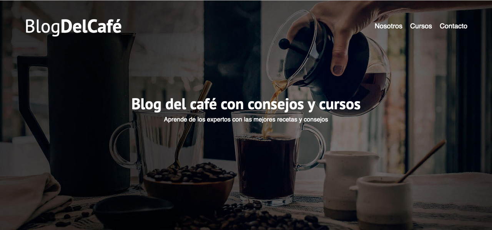

<h1 align="center">Proyecto Blog del Café</h1>

  

Este blog fue creado con el objetivo de consolidar mis conocimientos en <strong>maquetación web</strong>, desarrollando una plataforma
informativa y educativa para los entusiastas del café. A través del blog, los usuarios pueden acceder a artículos detallados
sobre diferentes variedades de café, técnicas de preparación y las últimas tendencias en la industria cafetera.
También incluye una sección dedicada a cursos y talleres, además de un formulario de contacto, ofreciendo así una
experiencia de usuario completa, intuitiva y atractiva.

## Tecnologías Utilizadas

Para este proyecto, se han utilizado las siguientes tecnologías:

<table align="center">
  <tr align="center">
    <th><strong>Frontend</strong></th>
    <th><strong>Infraestructura</strong></th>
  </tr>
  <tr align="center">
    <td>
      
      
      
    </td>
    <td>
      
      
    </td>
  </tr>
</table>

En el desarrollo de este proyecto, se utilizó <strong>HTML5</strong> para estructurar el contenido del blog de
manera clara y semántica, asegurando una base sólida para la accesibilidad y el SEO. Por otro lado,
<strong>CSS3</strong> fue empleado para el diseño visual del sitio, utilizando técnicas avanzadas como <strong>CSS Grid</strong> y <strong>Flexbox</strong> para lograr un diseño responsivo y adaptable a diferentes dispositivos. Esto garantiza una presentación coherente y optimizada, sin importar el tamaño de la pantalla.

<strong>JavaScript</strong> se implementó para la validación del formulario en el lado del cliente, verificando la
entrada de datos y garantizando su correcto formato antes de enviarlo al servidor. Esto mejora la experiencia del
usuario al evitar errores en tiempo real.

El despliegue de la aplicación se realizó mediante un <strong>pipeline de CI/CD</strong>, lo que asegura un flujo de
trabajo ágil y eficiente. Con la integración continua en <strong>GitHub</strong> y el despliegue automatizado en
<strong>Netlify</strong>, cada actualización del blog se lleva a cabo de manera rápida y sin interrupciones,
manteniendo la aplicación siempre disponible, actualizada y lista para los usuarios.

## Contacto

Cristian Eduardo Castro Vargas  
[Email](cj.94@hotmail.com) | [LinkedIn](https://www.linkedin.com/in/cristian-castro-vargas/) | [Portafolio](https://cristian-castro.com/)
